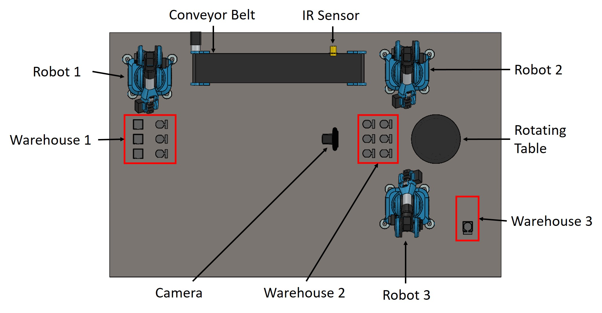
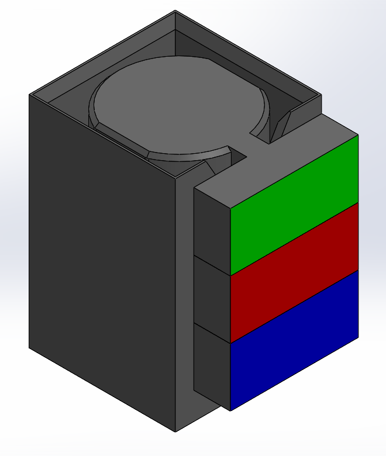

# Production Line Device Package

This package contains all the nodes needed for controlling the production line. Furthermore, custom messages have been created to simplify communication of information between the devices and the production line or between the FlexBE behavior for managing errors and the production line.

Before going into further details, it's helpful to understand the production line realized for this work. The assembly process starts on the left side and proceeds in the right direction.




The devices of the production line are numerated based on their own position (sensors and camera are exluded from this count). The numbering is the following:
- Robot 1: device_1
- Conveyor Belt: device_2
- Robot 2: device_3
- Rotating Table: device_4
- Robot 3: device_5.

The assembled product consists of a case and three internal elements. The order in which these elements are inserted is determined by a randomly generated color code.

<p align="center">
    
</p>

The package relative of the control of rotating table and the behaviors and state of FlexBE can be found at these links:
- [rotating_table](https://github.com/LucaCristuibGrizzi/rotating_table "rotating_table")
- [production_ line_behaviors](https://github.com/LucaCristuibGrizzi/production_line_behaviors "production_line_behaviors")

In the "documents" folder, you can find the [thesis](documents/Thesis.pdf) resulting from this work. This document provides more detailed information about the architecture of the control, the algorithm for handling errors in the production line, and other relevant details.

## Installation

Clone the following repository into your ROS workspace:

```bash
git clone https://github.com/LucaCristuibGrizzi/production_line_device
```

Build you workspace:

```bash
catkin_make # or catkin build
```

The robots in the production line are made by *Niryo* and are controlled with the *PyNiryo* library. So it needs to be installed.

```bash
pip install pyniryo==1.1.2
```

Please note that to make the production line work, you need to clone the other two repositories (rotating_table and production_line_behaviors) in the correct way.

## Setup

After recreating the production line layout, the first step is to redefine all the joint poses of the robot. During this operation, it is important to maintain the nomenclature described in the comments of the ["Pose.py"](scripts/Utils/Pose.py) script. This operation can be completed in two ways:

1. **With Niryo Studio**

2. **With a script that allows moving the robot in jog mode and reading its joint poses** (check this [file](scripts/Utils/getJointPose.py)).  

For the check assembly operation, it is advisable to perform a calibration to determine optimal thresholding values for the colors. You can use this [script](scripts/Utils/findHSV.py) to calibrate the required HSV values.

The last setup operation to perform is to check and, if needed, change the IP address to connect the PC to the robots. The Ethernet connection is the one chosen for this project, so an Ethernet switch is needed. Each robot has a different IP address, which can be changed with Niryo Studio. The IP addresses are as follows:

- Robot 1: 164.254.200.200
- Robot 2: 164.254.200.201
- Robot 3: 164.254.200.202

The IP address of the PC for cable connection also needs to be modified. With the OS Ubuntu, you can follow this [tutorial on IP configuration](https://docs.niryo.com/applications/ned/v1.0.4/en/source/tutorials/setup_connect_ned_ethernet.html). The IP address used in this project is 164.254.200.205.

## Usage

Before proceeding with this section, it is advisable to have looked and followed the instructions of the [rotating_table](https://github.com/LucaCristuibGrizzi/rotating_table "rotating_table") and [production_line_behaviors](https://github.com/LucaCristuibGrizzi/production_line_behaviors "production_line_behaviors") packages.

There are four steps to follow:

1. Execute this command in a terminal to open FlexBE:

    ```bash
    roslaunch flexbe_app flexbe_full.launch
    ```

2. Open an SSH connection with the rotating table and launch its ROS node. After the first command, you will be prompted for the Raspberry Pi password. In this project, it is ARSCONTROL, but it should be the one specified during the download process of Ubuntu Server. The commands are as follows:

    ```bash
    ssh <username>@<Raspberry Pi’s IP address>
    rosrun rotating_table rotating_table.py
    ```

3. Launch all the nodes of devices of the production line. Each command must be executed in a different terminal:

    ```bash
    rosrun production_line_device robot1.py
    rosrun production_line_device robot2.py
    rosrun production_line_device robot3.py
    rosrun production_line_device visionCheck.py
    rosrun production_line_device userWindow.py
    ```

    These commands are the only ones needed for the sequential behavior of the production line. For the behavior that handles the errors of the line, the following command must also be executed:

    ```bash
    rosrun production_line_device productionLine.py
    ```

4. The last operation is to load the production line behaviors, i.e. "Sequential Production Line" or "Production Line", and start its execution in FlexBE.

**NOTE:** This is an example of how to generate an error (refer to the comments of the individual scripts of the devices for a better understanding). In this case, the generated error is a slowdown of Robot 2 at its second call for a pick-and-place operation.

```bash
rosrun production_line_device robot2.py -s2
```

All the previous steps can be combined in a single launch file, but during the testing phase, the detailed instructions provided earlier offer users more control and insight.

## Libraries Version

- **ROS Noetic**: 1.16.0
- **Pyhton**: 3.8.10
- **PyNiryo**: 1.1.2
- **OpenCV**: 4.8.0
- **tkinter**: 8.6.12